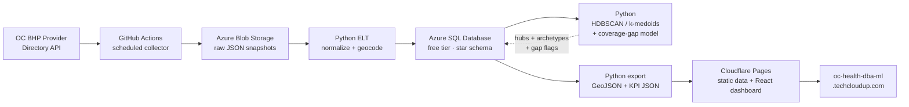

# OC Medi-Cal Behavioral Health Provider Clustering & Accessibility Analysis

A **DBA + BI + ML** portfolio project built on the **Orange County Health Care Agency (OC HCA) Behavioral Health Plan (BHP) Provider Directory API**, delivered as a live web dashboard.

> **Live dashboard:** <https://oc-health-dba-ml.techcloudup.com>
>
> **Data source:** `https://bhpproviderdirectory.ochca.com/api/v1/` (public, no auth key)

---

## What this project demonstrates

| Skill | Demonstrated by |
|-------|-----------------|
| **DBA** | Star-schema modeling, normalization of `;`-delimited multi-value fields, index design + query-plan evidence, spatial (`GEOGRAPHY`) queries, TDE + firewall + Entra ID security, backup/restore runbook (see [`docs/runbook.md`](docs/runbook.md)) |
| **BI** | Data modeling, SQL analytics views, KPI/metric definitions, and a custom React web dashboard (maps, charts, filters) — the "modern BI" alternative to Power BI |
| **ML** | Mixed-type clustering (Gower + k-medoids/HDBSCAN), spatial service-hub detection (HDBSCAN), accessibility gap modeling (Getis-Ord Gi\*), honest model evaluation (DBCV / silhouette-width), MLflow tracking (see [`docs/ml_design.md`](docs/ml_design.md)) |

## Architecture



**Why static serving:** with ~1,851 providers the entire dataset is a few MB of JSON, so the dashboard loads it once and filters client-side. This removes a running backend (no cold-start, no cost, no auth surface) and keeps the live site available even while Azure SQL free tier auto-pauses.

## Repository layout

```
oc-health-dba-ml/
├── README.md
├── note.md                    # master implementation plan (source of truth)
├── .env.example               # non-secret config placeholders
├── infra/terraform/           # Azure SQL (azapi free offer), Storage, firewall (IaC)
├── src/
│   ├── collector/             # GitHub Actions: paginated API -> Blob
│   ├── etl/                   # Blob -> Azure SQL (normalize + geocode)
│   │   └── ddl/               # 00_staging, 10_dim, 20_fact, 30_indexes
│   ├── ml/                    # spatial_hubs, archetypes, accessibility_gap
│   └── serve/                 # SQL -> static GeoJSON + KPI JSON
├── web/                       # React + TS dashboard (Cloudflare Pages)
├── .github/workflows/         # pipeline.yml (collect->export), deploy.yml
└── docs/
    ├── api_reference.md       # verified upstream API schema
    ├── data_dictionary.md     # star-schema data dictionary
    ├── erd.md                 # entity relationship diagram
    ├── ml_design.md           # 3-analysis ML design (v2)
    └── runbook.md             # DBA backup/restore + security runbook
```

## Quick start

### Prerequisites

- Python 3.11+ (`python3 -m venv .venv`)
- Node 20+ (for the dashboard)
- Azure account (SQL Database free offer, Blob Storage)
- Cloudflare account with a zone for the custom domain

### 1. Verify upstream data

```bash
curl "https://bhpproviderdirectory.ochca.com/api/v1/Provider/providers?page=1&pageSize=1"
# expect: { "data": [...], "totalCount": 1851, ... }
```

### 2. Local environment

```bash
cp .env.example .env   # fill in values
python3 -m venv .venv && source .venv/bin/activate
pip install -r src/collector/requirements.txt \
            -r src/etl/requirements.txt \
            -r src/ml/requirements.txt
```

### 3. Run the pipeline (per phase)

| Phase | Command | Output |
|-------|---------|--------|
| Collect | `python -m src.collector.collect` | raw JSON snapshots in Blob |
| Transform & load | `python -m src.etl.load_providers` | populated star schema |
| ML | `python -m src.ml.archetypes` | hubs / archetypes / gaps written to SQL |
| Serve | `python -m src.serve.export` | `web/public/data/*.json` + `*.geojson` |

### 4. Run the dashboard

```bash
cd web && npm install && npm run dev
```

## Documentation index

- **Plan & acceptance criteria** — [`note.md`](note.md)
- **Upstream API** — [`docs/api_reference.md`](docs/api_reference.md)
- **Data model** — [`docs/data_dictionary.md`](docs/data_dictionary.md), [`docs/erd.md`](docs/erd.md)
- **ML design** — [`docs/ml_design.md`](docs/ml_design.md)
- **DBA operations** — [`docs/runbook.md`](docs/runbook.md)

## Cost

| Service | Expected cost |
|---------|---------------|
| Azure SQL Database (serverless free offer) | $0 |
| Azure Blob Storage | < $1/mo |
| GitHub Actions | $0 |
| Geocoding (US Census, keyless) | $0 |
| Cloudflare Pages + DNS + SSL | $0 |
| **Total** | **< $1–5/mo** |
