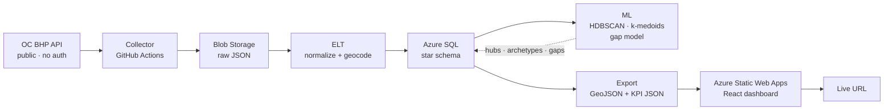
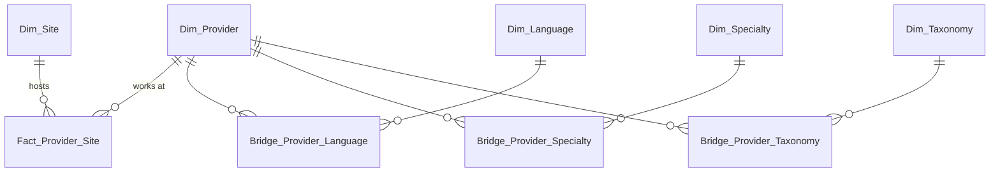

# OC Medi-Cal Behavioral Health Provider Clustering & Accessibility Analysis


A **DBA + BI + ML (machine learning)** project that turns the **Orange County Health Care Agency (OC HCA) Behavioral Health Plan (BHP) Provider Directory API** — public, no-auth JSON — into a star-schema data warehouse, unsupervised ML, and a live web dashboard.

> **Live dashboard:** <https://wonderful-forest-05492831e.2.azurestaticapps.net> · **Data source:** `https://bhpproviderdirectory.ochca.com/api/v1/`

---

## At a glance

| | | |
|---|---|---|
| **1,851** providers | **147** sites · 100% geocoded | **20-table** star schema |

## What this project demonstrates

| Skill | Demonstrated by |
|-------|-----------------|
| **DBA** | Star-schema modeling · `;`-delimited field normalization · index design · `GEOGRAPHY` spatial queries · TDE + Entra ID + firewall · backup/restore runbook ([`docs/runbook.md`](docs/runbook.md)) |
| **BI** | Data modeling · SQL analytics views · KPI definitions · React + MapLibre dashboard (maps, charts, filters) |
| **ML (machine learning)** | HDBSCAN spatial hubs · Gower + k-medoids archetypes · accessibility-gap model — with honest DBCV / silhouette evaluation ([`docs/ml_design.md`](docs/ml_design.md)) |

## Architecture



**Why static serving:** ~1,851 providers = a few MB of JSON, so the dashboard loads it once and filters client-side. No running backend, no cold-start, no cost — the site stays live even while Azure SQL free tier auto-pauses.

## Data model (star schema)



Full data dictionary and ERD: [`docs/data_dictionary.md`](docs/data_dictionary.md) · [`docs/erd.md`](docs/erd.md)

## ML — three analyses

| Analysis | Technique | Evaluation | Output table |
|----------|-----------|------------|--------------|
| **Spatial service hubs** | HDBSCAN (Haversine metric) | DBCV | `ML_Site_Hub` |
| **Provider archetypes** | Gower distance + k-medoids (PAM) | silhouette-width | `ML_Provider_Archetype` |
| **Accessibility gaps** | spatial coverage (10 km radius) | nearest-neighbor distance | `ML_Accessibility_Gap` |

> Honest-failure principle: if silhouette < 0.2, the "homogeneous workforce" finding is reported as-is rather than inflated.

## Repository layout

```
oc-health-dba-ml/
├── README.md
├── .env.example               # non-secret config placeholders
├── infra/terraform/           # Azure SQL (azapi free offer), Storage, firewall (IaC)
├── src/
│   ├── collector/             # GitHub Actions: paginated API -> Blob
│   ├── etl/                   # Blob -> Azure SQL (normalize + geocode)
│   │   └── ddl/               # 00_reset, 00_staging, 10_dim, 20_fact, 30_indexes, 40_ml
│   ├── ml/                    # spatial_hubs, archetypes, accessibility_gap
│   └── serve/                 # SQL -> static GeoJSON + KPI JSON
├── web/                       # React + TS dashboard (Azure Static Web Apps)
├── .github/workflows/         # pipeline.yml (collect->export), deploy.yml
└── docs/
    ├── api_reference.md       # verified upstream API schema
    ├── data_dictionary.md     # star-schema data dictionary
    ├── erd.md                 # entity relationship diagram
    ├── ml_design.md           # 3-analysis ML design (v2)
    └── runbook.md             # DBA backup/restore + security runbook
```

## Quick start

### Prerequisites

- Python 3.11+ · Node 20+ · Azure account (SQL free offer, Blob Storage, Static Web Apps)

### 1. Verify upstream data

```bash
curl "https://bhpproviderdirectory.ochca.com/api/v1/Provider/providers?page=1&pageSize=1"
# expect: { "data": [...], "totalCount": 1851, ... }
```

### 2. Local environment

```bash
cp .env.example .env   # fill in values
python3 -m venv .venv && source .venv/bin/activate
pip install -r src/collector/requirements.txt \
            -r src/etl/requirements.txt \
            -r src/ml/requirements.txt
```

### 3. Run the pipeline

| Phase | Command | Output |
|-------|---------|--------|
| Collect | `python -m src.collector.collect` | raw JSON snapshots |
| Transform & load | `python -m src.etl.run` | populated star schema |
| ML | `python -m src.ml.run` | hubs / archetypes / gaps |
| Serve | `python -m src.serve.export` | `web/public/data/*.json` + `*.geojson` |

### 4. Run the dashboard

```bash
cd web && npm install && npm run dev
```

## Documentation

- **Upstream API** — [`docs/api_reference.md`](docs/api_reference.md)
- **Data model** — [`docs/data_dictionary.md`](docs/data_dictionary.md) · [`docs/erd.md`](docs/erd.md)
- **ML design** — [`docs/ml_design.md`](docs/ml_design.md)
- **DBA operations** — [`docs/runbook.md`](docs/runbook.md)
