# Entity Relationship Diagram

```mermaid
erDiagram
    Dim_Provider ||--o{ Fact_Provider_Site : "works at"
    Dim_Site ||--o{ Fact_Provider_Site : "hosts"
    Dim_Provider ||--o{ Bridge_Provider_Language : "speaks"
    Dim_Language ||--o{ Bridge_Provider_Language : ""
    Dim_Provider ||--o{ Bridge_Provider_Specialty : "offers"
    Dim_Specialty ||--o{ Bridge_Provider_Specialty : ""
    Dim_Provider ||--o{ Bridge_Provider_Taxonomy : ""
    Dim_Taxonomy ||--o{ Bridge_Provider_Taxonomy : ""
    Dim_Provider ||--o{ Bridge_Provider_Service : ""
    Dim_Service_Type ||--o{ Bridge_Provider_Service : ""
    Dim_Provider ||--o{ Bridge_Provider_Population : ""
    Dim_Population_Served ||--o{ Bridge_Provider_Population : ""
    Dim_Provider ||--o{ Bridge_Provider_CulturalCap : ""
    Dim_Licensure_Type ||--o{ Fact_Provider_Site : ""
    Dim_Provider ||--o{ ML_Provider_Archetype : "segmented"
    Dim_Site ||--o{ ML_Site_Hub : "clustered"
```

## Cardinalities

| Relationship | Cardinality | Table |
|--------------|-------------|-------|
| Provider ↔ Site | **M:N** | `Fact_Provider_Site` |
| Provider ↔ Language | M:N | `Bridge_Provider_Language` |
| Provider ↔ Specialty | M:N | `Bridge_Provider_Specialty` |
| Provider ↔ Taxonomy | M:N | `Bridge_Provider_Taxonomy` |
| Provider ↔ Service type | M:N | `Bridge_Provider_Service` |
| Provider ↔ Population served | M:N | `Bridge_Provider_Population` |
| Provider ↔ Cultural capability | M:N | `Bridge_Provider_CulturalCap` |

## Design notes

1. **The provider ↔ site bridge is the fact table.** One provider works at many sites; one site hosts many providers (`providerSites[]` in the API). Grain = one provider-at-site.
2. **`;`-delimited multi-value fields → junction tables.** The raw API stores `taxonomy`, `serviceType`, `specialtiesPd`, `populationServedPd`, `culturalCapabilitiesPd` as `;`-joined strings; each is split into a `Bridge_*` row for referential integrity.
3. **Spatial enrichment.** `Dim_Site.latitude`/`longitude` are geocoded (not in the API) and backed by a `GEOGRAPHY` column + spatial index for radius/distance queries feeding the accessibility gap model.
4. **SCD2.** Use the API's native `effDate`/`expDate` on `Fact_Provider_Site` (not `snapshot_date`) as the slowly-changing-dimension mechanism.
