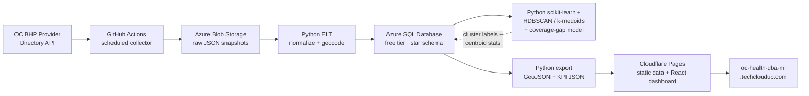

# OC Medi-Cal Behavioral Health Provider Clustering & Accessibility Analysis

A **DBA + BI + ML** portfolio project built on the **Orange County Health Care Agency (OC HCA) Behavioral Health Plan (BHP) Provider Directory API**, delivered as a **live web dashboard**.

> **Status: BUILDABLE.** This document is an executable implementation plan, not just a proposal. It contains a verified API reference (probed live), a concrete repo layout, an actual star-schema design derived from the real JSON fields, and per-phase acceptance criteria.

> **Final deliverable:** a public web dashboard at `https://oc-health-dba-ml.techcloudup.com`, hosted on Cloudflare (domain already in a Cloudflare zone).

---

## 1. Project Overview

| Item | Value |
|------|-------|
| **Project name** | OC Medi-Cal Behavioral Health Provider Clustering & Accessibility Analysis |
| **Goal** | Showcase **DBA, BI, and ML** skills end-to-end: design a data warehouse, run unsupervised ML, and surface decision-ready insights in a **public web dashboard** |
| **Data source** | OC HCA BHP Provider Directory API (public REST, JSON) |
| **Analytics backend** | Azure SQL Database (free offer) · Azure Blob Storage · GitHub Actions · Python (scikit-learn) |
| **Presentation layer** | React + TypeScript web dashboard (MapLibre GL maps, Recharts), deployed to **Cloudflare Pages** |
| **Production URL** | `https://oc-health-dba-ml.techcloudup.com` |
| **ML technique** | HDBSCAN (spatial service hubs) + Gower/k-medoids (provider archetypes) + spatial coverage-gap model, with DBCV/silhouette/Gi* evaluation |

### 1.1 How Each Skill Is Demonstrated

| Skill | Where it shows up |
|-------|-------------------|
| **DBA** | Star-schema modeling, normalization of `;`-delimited multi-value fields, index design, spatial (`GEOGRAPHY`) queries, TDE + firewall + Entra ID security, GitHub Actions pipeline automation, backup/restore runbook |
| **BI** | Data modeling, SQL analytics views, KPI/metric definitions, and a **custom web dashboard** (maps, charts, filters) — the "modern BI" alternative to Power BI |
| **ML** | Mixed-type clustering (Gower distance + k-medoids/HDBSCAN), spatial hub detection (HDBSCAN), accessibility gap modeling (Getis-Ord Gi*), honest model evaluation (DBCV/silhouette-width), MLflow run tracking + model registry |

> Power BI is **optional and complementary** (it remains a recruiter-recognized tool), but the web dashboard is the primary, live deliverable.

---

## 2. Verified Data Source Reference

> These facts were confirmed by probing the live API (not assumed). Always re-verify before coding.

### 2.1 Endpoints

| Item | Value |
|------|-------|
| **Base URL** | `https://bhpproviderdirectory.ochca.com/api/v1/` |
| **Authentication** | **None** (publicly accessible, no API key) |
| **Swagger / OpenAPI** | `https://bhpproviderdirectory.ochca.com/api/swagger/index.html` |
| **API docs page** | `https://bhpproviderdirectory.ochca.com/api-document` |
| **Machine-readable dumps** | `https://bhpproviderdirectory.ochca.com/machine-readable-data` (full Provider JSON + Site JSON) |
| **Data freshness** | Updated no later than 30 calendar days after a provider change |

### 2.2 Collections & Key Endpoints

**Lookup collection** (reference code lists — the foreign-key universe):
`/v1/Lookup/specialties`, `/service-codes`, `/gender-codes`, `/language-codes`, `/taxonomy`, `/facility-types`, `/schedule-codes`, `/population-served-codes`, `/licensure-codes`, `/state-codes`, `/cultural-cap-codes`, `/telehealths`

**Provider collection**:
- `/v1/Provider/providers?page={n}&pageSize={n}` — paginated list
- `/v1/Provider/{providerId}` — single provider detail
- `/v1/Provider/search?...` — filtered search (FirstName, LastName, Gender, Language, Speciality, ProviderType, Telehealth, AcceptNewPatient, Medicare, CHIP, TGITraining, CulturalCapabilityTraining, CulturalCapability). Multi-value filters use `;` delimiter (e.g. `?Gender=M;F`).

**Site collection**:
- `/v1/Site/sites?page={n}&pageSize={n}` — facility/location records

### 2.3 Response Envelope (pagination)

```json
{
  "data": [ /* array of records */ ],
  "totalCount": 1851,
  "currentPage": 1,
  "pageSize": 100,
  "totalPages": 19
}
```

### 2.4 Provider Record Schema (actual fields)

```json
{
  "id": 10,
  "lastName": "Gonzalez",
  "firstName": "Andrea",
  "middleName": "Guadalupe",
  "gender": "F",
  "npi": "1285300319",
  "taxonomy": "101Y00000X;101YM0800X",
  "engFluency": "Y",
  "culturalTraining": "Y",
  "medicarePd": "Y",
  "culturalCapabilitiesPd": "A1;A2;A3;B1;C1;...",
  "chipPd": "N",
  "tgitrainingPd": "N",
  "providerLanguages": [ { "providerId": 10, "code": "spa", "fluency": "A", "validFlag": "Y" } ],
  "providerSites": [ /* see 2.5 */ ]
}
```

### 2.5 Provider ↔ Site (many-to-many) and Site Schema

A provider has a `providerSites[]` array — **one provider can work at multiple sites, one site hosts many providers.**

```json
{
  "id": 10, "providerId": 10, "siteId": 21, "isPrimary": true,
  "effDate": "2023-07-01", "expDate": "2028-06-30",
  "licenseNumber": "22965", "licenseType": "PCC",
  "serviceType": "MH;TC",
  "telehealthFlag": "B", "acceptNew": "Y", "validFlag": "Y",
  "populationServedPd": "ADL;ADT;CYS;TAY",
  "specialtiesPd": "1A;3A;4A;5A;7A;...",
  "site": {
    "id": 21, "planType": "MHP", "name": "CYS Seneca OC South",
    "entity": "00115", "npi2": "1376034371",
    "taxonomy": "251S00000X",
    "address": "22942 EL TORO RD", "city": "LAKE FOREST",
    "state": "CA", "zipCode": "92630-4961", "phone": "(949) 317-1010",
    "webSite": "http://www.senecafoa.org",
    "adacompliant": "Y", "tddTtyAvail": "Y", "telehealthAvail": "B",
    "facilityCode": "25", "serviceType": "CIS;ICC;IHB;..."
  }
}
```

### 2.6 Critical Data Facts That Drive the Design

1. **No latitude/longitude anywhere** — only street address + ZIP. **Geocoding is a mandatory step** (see Phase 4).
2. **Provider ↔ Site is many-to-many** — requires a bridge table (`Fact_Provider_Site`).
3. **Multi-value fields use `;` delimiters** — `taxonomy`, `serviceType`, `specialtiesPd`, `populationServedPd`, `culturalCapabilitiesPd`. Each must be split into normalized junction tables.
4. **Small dataset (~1,851 providers, 163 sites)** — a single Python/Azure Function collector is sufficient. Azure Data Factory is optional overkill; a lightweight ELT script is the pragmatic default. It also means the entire dashboard dataset fits comfortably in a static JSON payload (client-side filtering).
5. **Lookup codes are the join keys** — `specialtiesPd` codes join to `/Lookup/specialties`, `serviceType` to `/service-codes`, etc.
6. **Skewed provider workforce** — ~70% female (F 1,293 / M 540); 25% Spanish-bilingual (467 providers); provider mix dominated by therapists/counselors (MFT 370, addiction counselor 366, social worker 195) with psychiatrists a small minority (116). 70 distinct taxonomies, 26 languages. This skew means **attribute-only clustering will be weak — the strongest differentiation is geographic.**
7. **~89% accept new patients; telehealth is widespread** (telehealthFlag B=944 of ~2,339 provider-site records). "Accepts new patients" is a weak clustering discriminator but a key accessibility filter.

---

## 3. Architecture



**Data flow:**

1. **Collect** — a GitHub Actions scheduled job (`pipeline.yml`) pages through `/v1/Provider/providers` + `/v1/Site/sites` and writes raw JSON snapshots to Blob Storage.
2. **Transform & load** — a Python ELT script reads Blob snapshots, normalizes `;`-delimited fields, geocodes addresses, and upserts into the Azure SQL star schema.
3. **ML** — HDBSCAN detects spatial service hubs; Gower + k-medoids segments provider archetypes; a coverage-gap model flags underserved ZIPs. Labels/hubs/gaps are written back to SQL.
4. **Serve** — a Python export script queries the star schema and emits static `GeoJSON` + aggregated `JSON` files (cluster profiles, ZIP-level accessibility metrics, filter lookups).
5. **Visualize** — a React + TypeScript dashboard loads the static data and renders the map + analytics views on Cloudflare Pages.

**Why static serving instead of a live DB API:** with ~1,851 providers the entire dataset is a few MB of JSON, so the dashboard loads it once and filters client-side. This removes a running backend (no cold-start, no cost, no auth surface) and keeps the live site always available even while the Azure SQL free tier is auto-paused. The DBA/BI depth still lives in the SQL layer; the serving layer is a thin, reproducible export.

---

## 4. Repository Layout

```
oc-health-dba-ml/
├── README.md
├── note.md                        # this document
├── .gitignore
├── .env.example                   # non-secret config placeholders
├── infra/
│   └── terraform/
│       ├── main.tf                # Azure SQL free offer (azapi) + Storage + firewall
│       ├── providers.tf           # azurerm + azapi provider config
│       └── variables.tf
├── src/
│   ├── collector/                 # run by GitHub Actions (pipeline.yml)
│   │   ├── collect.py             # entrypoint (schedule + manual dispatch)
│   │   ├── api_client.py          # paginated /v1 client
│   │   └── requirements.txt
│   ├── etl/                       # Blob → Azure SQL
│   │   ├── load_lookups.py
│   │   ├── load_providers.py
│   │   ├── geocode.py             # address → lat/lng
│   │   ├── ddl/
│   │   │   ├── 00_staging.sql
│   │   │   ├── 10_dim.sql
│   │   │   ├── 20_fact.sql
│   │   │   └── 30_indexes.sql
│   │   └── requirements.txt
│   ├── ml/                        # spatial hubs + archetypes + gap model
│   │   ├── features.py            # Gower feature matrix
│   │   ├── spatial_hubs.py        # HDBSCAN on geocoded sites
│   │   ├── archetypes.py          # Gower + k-medoids / HDBSCAN
│   │   ├── accessibility_gap.py   # coverage gap + Getis-Ord Gi*
│   │   ├── evaluate.py            # DBCV / silhouette / Gi*
│   │   └── requirements.txt
│   └── serve/                     # SQL → static dashboard data
│       ├── export.py              # emits GeoJSON + KPI JSON to web/public/data
│       └── requirements.txt
├── web/                           # React dashboard (Cloudflare Pages)
│   ├── package.json
│   ├── vite.config.ts
│   ├── tailwind.config.ts
│   ├── index.html
│   ├── public/
│   │   └── data/                  # generated: sites.geojson, providers.json, ...
│   └── src/
│       ├── App.tsx
│       ├── main.tsx
│       ├── components/            # MapView, ClusterCards, KpiRow, FilterBar
│       ├── hooks/                 # useData (fetch + filter static JSON)
│       └── lib/                   # types, metrics.ts, geo.ts
├── .github/
│   └── workflows/
│       ├── pipeline.yml           # scheduled: collect → load → ML → export → commit
│       └── deploy.yml             # Cloudflare Pages deploy on push
└── docs/
    ├── data_dictionary.md
    └── erd.md
```

---

## 5. Data Model (Star Schema)

Derived 1:1 from the verified JSON fields. `;`-delimited columns are normalized into junction tables.

### 5.1 Dimension Tables

**`Dim_Provider`** (grain = one provider)

| Column | Type | Source field |
|--------|------|--------------|
| provider_key | INT IDENTITY PK | — |
| provider_id | INT | `id` |
| first_name / middle_name / last_name | NVARCHAR | `firstName` etc. |
| gender_code | CHAR(1) | `gender` |
| npi | CHAR(10) | `npi` |
| english_fluency_flag | CHAR(1) | `engFluency` |
| cultural_training_flag | CHAR(1) | `culturalTraining` |
| accepts_medicare_flag | CHAR(1) | `medicarePd` |
| accepts_chip_flag | CHAR(1) | `chipPd` |
| tgi_training_flag | CHAR(1) | `tgitrainingPd` |

**`Dim_Site`** (grain = one location)

| Column | Type | Source field |
|--------|------|--------------|
| site_key | INT IDENTITY PK | — |
| site_id | INT | `id` |
| name | NVARCHAR | `name` |
| plan_type | VARCHAR | `planType` |
| npi2 | CHAR(10) | `npi2` |
| taxonomy_code | VARCHAR | `taxonomy` |
| address1 / address2 / city / state / zip | NVARCHAR | `address`... |
| phone / website | NVARCHAR | `phone`/`webSite` |
| ada_compliant_flag / tdd_tty_flag | CHAR(1) | `adacompliant` etc. |
| **latitude / longitude** | DECIMAL(9,6) | **geocoded (not in API)** |
| census_tract / county | NVARCHAR | geocoded enrichment (optional) |

**`Dim_Service_Type`**, **`Dim_Specialty`**, **`Dim_Taxonomy`**, **`Dim_Language`**, **`Dim_Population_Served`**, **`Dim_Gender`**, **`Dim_Licensure_Type`**, **`Dim_Date`** — each keyed by the API's lookup `code` with a `description` column.

### 5.2 Fact Table

**`Fact_Provider_Site`** (grain = one provider at one site — the M:N bridge)

| Column | Type | Source field |
|--------|------|--------------|
| provider_site_key | INT IDENTITY PK | — |
| provider_key | INT FK → Dim_Provider | — |
| site_key | INT FK → Dim_Site | — |
| is_primary_flag | BIT | `isPrimary` |
| eff_date / exp_date | DATE | `effDate`/`expDate` |
| license_number / license_type_code | NVARCHAR | `licenseNumber`/`licenseType` |
| telehealth_flag | CHAR(1) | `telehealthFlag` |
| accepting_new_patients_flag | CHAR(1) | `acceptNew` |
| valid_flag | CHAR(1) | `validFlag` |
| snapshot_date | DATE | ingestion timestamp (SCD2 helper) |

### 5.3 Junction Tables (M:N normalization of `;` fields)

- `Bridge_Provider_Specialty` (`provider_id`, `specialty_code`)
- `Bridge_Provider_Language` (`provider_id`, `language_code`, `fluency`)
- `Bridge_Provider_Taxonomy` (`provider_id`, `taxonomy_code`)
- `Bridge_Provider_Service` (`provider_id`, `service_code`)
- `Bridge_Provider_Population` (`provider_id`, `population_code`)
- `Bridge_Provider_CulturalCap` (`provider_id`, `cap_code`)

### 5.4 Indexing Strategy (DBA practice)

- **Clustered**: PKs on `*_key` identity columns.
- **Non-clustered**: `Dim_Site(zip_code)`, `Fact_Provider_Site(provider_key, site_key)`, `Fact_Provider_Site(site_key)`, `Dim_Provider(npi)`, `Dim_Site(latitude, longitude)`.
- **Spatial**: `GEOGRAPHY` column on `Dim_Site` for radius/distance queries (accessibility analysis).

### 5.5 ML Output Tables (written back to SQL)

- `ML_Site_Hub` (`site_id`, `hub_id`, `is_noise`, `run_id`, `scored_at`) — HDBSCAN spatial hubs (noise = underserved pockets).
- `ML_Provider_Archetype` (`provider_id`, `archetype`, `run_id`, `scored_at`) — Gower + k-medoids segmentation.
- `ML_Archetype_Profile` (`archetype`, `member_count`, `dominant_language`, `dominant_provider_type`, `accept_new_rate`, `profile_summary`).
- `ML_Accessibility_Gap` (`zip_code`, `dimension`, `gap_flag`, `nearest_km`, `gi_star_z`, `scored_at`) — coverage-gap model.

---

## 6. Implementation Phases (with acceptance criteria)

### Phase 0 — Local Dev Environment (Week 1)

**Deliverables**: working local SQL + Python env; repo scaffolded.

- [ ] Create Azure free account; provision **Azure SQL Database free offer** (serverless, 32 GB, 100k vCore-sec/month) via **Terraform** — `azurerm` for the serverless DB + `azapi` for the `useFreeLimit = true` free-offer flag.
- [ ] Alternative for local dev: SQL Server 2022 in Docker (`mcr.microsoft.com/mssql/server`).
- [ ] Create Azure Blob Storage container `raw-provider-json`.
- [ ] `python3 -m venv .venv`; install `requests`, `pandas`, `pyodbc`, `scikit-learn`, `mlflow`, `python-dotenv`.
- [ ] Scaffold `web/` with Vite + React + TypeScript + Tailwind.
- [ ] Verify connectivity: `curl "https://bhpproviderdirectory.ochca.com/api/v1/Provider/providers?page=1&pageSize=1"` returns `totalCount` ≈ 1851.

**Acceptance**: `curl` to every `/v1/Lookup/*` endpoint returns a JSON array of codes; SQL connection string works; `npm run dev` serves the empty dashboard locally.

### Phase 1 — Ingestion (Weeks 2–3)

**Deliverables**: `src/collector/` running as a **GitHub Actions scheduled job**; raw snapshots in Blob.

- [ ] `api_client.py` — generic paginator that walks `page`/`pageSize` until `currentPage == totalPages`; writes each page as a timestamped JSON file to Blob.
- [ ] Collect three datasets: providers, sites, and every lookup table.
- [ ] `collect.py` — invoked by `.github/workflows/pipeline.yml` (`schedule` + `workflow_dispatch` for backfill).
- [ ] Store full raw JSON (never truncate) for reproducibility / reprocessing.

**Acceptance**: a single backfill run produces a complete, idempotent snapshot (rerunning yields the same `totalCount` with no duplicates).

### Phase 2 — Transform & Load (Weeks 3–4)

**Deliverables**: `src/etl/ddl/*.sql` + load scripts; populated star schema.

- [ ] `00_staging.sql` — `Staging_Provider`, `Staging_Site`, `Staging_ProviderSite` (raw-column, no normalization).
- [ ] Split `;`-delimited fields into junction tables.
- [ ] `10_dim.sql` / `20_fact.sql` — dimension + fact DDL as in §5.
- [ ] `geocode.py` — geocode `Dim_Site` addresses → `latitude`/`longitude`. Use **US Census Geocoder** (free, keyless, batch) or ZIP-centroid fallback from Census Gazetteer; Azure Maps as a paid fallback. Cache results in a `Geocode_Cache` table.
- [ ] `30_indexes.sql` — indexes + `GEOGRAPHY` column population.

**Acceptance**: `SELECT COUNT(*) FROM Fact_Provider_Site` ≈ number of `providerSites` entries; every `specialtiesPd` code resolves against `Dim_Specialty` (referential integrity 100%, no orphans).

### Phase 3 — DBA Hardening (Weeks 4–5)

**Deliverables**: security, automation, and observability demonstrated.

- [ ] Firewall rules restricted to allow-listed IPs; **Entra ID** auth for the SQL login (no SQL auth passwords in prod).
- [ ] **TDE** enabled on the database.
- [ ] Scheduling via **GitHub Actions** (`pipeline.yml` cron); Elastic Job Agent is optional (verify pricing before relying on it).
- [ ] Point-in-time restore test + a documented backup/restore runbook.

**Acceptance**: a non-allow-listed IP is rejected; TDE shows `encryption_state = 3`; a restore test completes and matches row counts.

### Phase 4 — Geocoding + ML Analytics (Weeks 6–7)

**Deliverables**: `src/ml/` producing three evidence-backed analyses (spatial hubs, provider archetypes, accessibility gaps) + a profiling report.

> **ML approach redesign (v2).** The original single K-Means pass was replaced after probing the live data. Verified facts driving the new design:
> - **163 sites across 21 cities / 35 ZIPs**, concentrated in north-central OC (Santa Ana 21, Anaheim 17, Orange 17) with a long tail of isolated sites (Brea 1, Fountain Valley 2). → **Density-based spatial clustering (HDBSCAN)** is the right tool; K-Means forces round clusters and mislabels the isolated "noise" that is *itself* the interesting signal.
> - **Provider mix is heavily skewed** (§2.6 facts 6–7): ~70% female, 25% Spanish-bilingual, MFT/counselor/social-worker dominated. → attribute-only clustering risks mushy clusters; use **Gower distance (mixed types) + k-medoids**, and report low-signal honestly if it occurs.
> - **~89% accept new patients; telehealth is widespread** → "accepts new patients" is a weak clustering feature, but a strong accessibility filter.

Three analyses, each with a chosen technique + honest evaluation:

**ML-1 — Spatial service-hub detection (HDBSCAN).**
- [ ] Geocode all `Dim_Site` rows (Phase 2/4 geocoder) → `latitude`/`longitude`.
- [ ] Cluster site coordinates with **HDBSCAN** (Haversine metric; `min_cluster_size` 3–5, tuned). HDBSCAN needs no `k`, handles non-convex density, and labels isolated sites as **noise** — interpreted as "underserved pockets", not bad points.
- [ ] Label each site `hub_id | NOISE`; persist to `ML_Site_Hub`.
- [ ] Evaluate with **DBCV** (density-based clustering validation — silhouette is misleading for non-convex clusters) + cluster persistence.

**ML-2 — Provider profile segmentation (Gower + k-medoids / HDBSCAN).**
- [ ] Feature engineering (one row per provider): numeric = # sites, # languages, # specialties, # populations served, cultural-cap breadth; grouped categorical = provider-type group (map the 70 taxonomies to a clinical hierarchy: Psychiatrist / Therapist-Counselor / Social Worker / Nursing / Other), gender, telehealth, accept-new, primary-language group (Spanish / Asian-language / English-only / Other).
- [ ] Compute **Gower distance** (handles mixed numeric+categorical) → **PAM (k-medoids)** via `scikit-learn-extra`, cross-checked with **HDBSCAN** on the Gower matrix / UMAP embedding.
- [ ] Choose `k` via **silhouette-width on the Gower matrix** (not raw Euclidean K-Means elbow).
- [ ] **Honest fallback**: if silhouette < ~0.2, document "provider workforce is broadly homogeneous in profile; the real differentiation is geographic" — a valid finding, not a failure.
- [ ] Persist `provider_id → archetype` to `ML_Provider_Archetype`.

**ML-3 — Accessibility gap model (spatial coverage + hotspot).**
- [ ] Per ZIP (or census tract), compute via SQL `GEOGRAPHY`: provider density, distance-to-nearest-provider, and **coverage gap** = (need dimension) × (no provider within 10 mi radius). Need dimensions: language (Spanish, Vietnamese, Korean…), provider type (Psychiatrist vs Therapist), population (Child/Youth vs Adult).
- [ ] Detect statistically significant underserved cold-spots with **Getis-Ord Gi\*** (optional) or a threshold-based gap rank.
- [ ] Persist to `ML_Accessibility_Gap` (ZIP, dimension, gap flag, nearest distance, z-score).

**Evaluation & reproducibility.**
- [ ] Record **DBCV** (ML-1), **silhouette-width on Gower** (ML-2), and **Gi\* z-scores** (ML-3) in **MLflow** (params/metrics/artifacts); register the archetype model.
- [ ] Emit `cluster_profile.md` documenting each hub/archetype with a human-readable label + the ranked gap list.

**Acceptance**: all three analyses persisted to SQL with their evaluation metric recorded; `cluster_profile.md` includes ≥1 *specific, decision-ready* gap finding (e.g., "ZIP 92675: 0 Vietnamese-speaking providers within 10 mi"); metrics visible in MLflow and SQL.

### Phase 5 — Web Dashboard + Serving Export (Weeks 8–9)

**Deliverables**: `src/serve/export.py` + a feature-complete React dashboard in `web/`.

**Serving export** (`export.py`):
- [ ] Emit `sites.geojson` — FeatureCollection of geocoded sites with `cluster_label` + per-site metrics in `properties`.
- [ ] Emit `providers.json`, `clusters.json`, `accessibility.json` (ZIP-level metrics), and `lookups.json` (filter options).
- [ ] Write all files to `web/public/data/`.

**Dashboard** (`web/`):
- [ ] **KPI row** — total providers, total sites, % accepting new patients, bilingual coverage %, active clusters.
- [ ] **Map view** — MapLibre GL map with provider sites colored by cluster; filters for service type, language, accepts-new-patients, telehealth.
- [ ] **Cluster view** — cards for each cluster (profile, dominant specialty/language, member count, centroid).
- [ ] **Accessibility view** — ZIP-level density choropleth + distance-to-nearest-provider; language-coverage gap highlights.
- [ ] Client-side data loading from `/data/*.json` (no backend at runtime).

**Acceptance**: `npm run build` succeeds; the dashboard renders all views from the static data; filtering works entirely client-side; `sites.geojson` loads in MapLibre.

### Phase 6 — Cloudflare Deployment (Week 9)

**Deliverables**: live dashboard at `https://oc-health-dba-ml.techcloudup.com`.

- [ ] Create a **Cloudflare Pages** project connected to the Git repo (build: `npm run build`, output: `web/dist`).
- [ ] Add custom domain `oc-health-dba-ml.techcloudup.com` (Pages → Custom domains; Cloudflare auto-provisions the CNAME + Universal SSL in the `techcloudup.com` zone).
- [ ] `.github/workflows/deploy.yml` — deploy on push to `main`.
- [ ] `.github/workflows/pipeline.yml` — scheduled (daily) job: collect → load → ML → `export.py` against Azure SQL (read-only service principal) → commit updated `/data/*.json` → trigger Pages rebuild.
- [ ] Verify HTTPS, canonical redirects, and that the DNS record resolves.

**Acceptance**: `curl -I https://oc-health-dba-ml.techcloudup.com` returns `200` over HTTPS; a manual `pipeline.yml` run updates the dashboard data.

### Phase 7 — Docs & Cost Optimization (Week 10)

**Deliverables**: polished portfolio artifacts.

- [ ] `docs/data_dictionary.md`, `docs/erd.md`, and a rich `README.md` (architecture diagram, screenshots, live URL, run instructions).
- [ ] Enable **60-min auto-pause** on the serverless SQL DB to minimize vCore-seconds.
- [ ] Final cost review + a "cost vs value" section.

**Acceptance**: a reviewer can clone the repo, follow `README.md`, and reproduce the pipeline + dashboard end-to-end.

---

## 7. Cost Estimate

| Service | Free tier | Expected cost |
|---------|-----------|---------------|
| Azure SQL Database (serverless free offer) | 100k vCore-sec/mo, 32 GB | $0 |
| Azure Blob Storage | 5 GB | < $1/mo |
| GitHub Actions | free (public) / 2,000 min/mo (private) | $0 |
| Geocoding (US Census) | free, keyless | $0 |
| ML (local scikit-learn + MLflow) | local compute | $0 |
| Cloudflare Pages | unlimited static requests | $0 |
| Cloudflare DNS + Universal SSL | included | $0 |
| **Total** | | **< $1–5/mo** |

> **Cost tips**: run the DB serverless with 60-min auto-pause; train HDBSCAN/k-medoids locally; serve the dashboard statically on Cloudflare Pages (no always-on backend, no egress fees); prefer the keyless US Census geocoder over paid Azure Maps.

---

## 8. Why This Project Stands Out

1. **Real public-sector healthcare data** — live OC BHP Provider Directory, exercised through a genuinely public, no-auth API.
2. **Full lifecycle, live in production** — ingestion → normalization → star schema → ML → a **deployed web dashboard at a real URL**, covering DBA + BI + ML in one artifact.
3. **Real data-modeling challenge** — M:N provider↔site relationships, `;`-delimited multi-value fields, and the geocoding gap are authentic engineering problems, not toy data.
4. **Modern BI, not just a tool demo** — the dashboard is a product (maps, KPIs, filters) that also demonstrates SQL analytics and metric design.
5. **Social impact** — accessibility-gap analysis is meaningful to public health policy.
6. **Disciplined cost control** — architecture that stays inside the free tier while remaining production-shaped.

---

## 9. Definition of Done (checklist)

- [ ] Collector runs idempotently against all three collections + lookups.
- [ ] Star schema populated with 100% referential integrity.
- [ ] Geocoding coverage > 95% of sites.
- [ ] ML suite delivered: spatial hubs (HDBSCAN, DBCV recorded), provider archetypes (Gower+k-medoids, silhouette-width recorded), accessibility gap model (ranked ZIP-level gaps); honest low-signal finding documented if applicable.
- [ ] Cluster profiles written with human-readable labels.
- [ ] Dashboard builds and renders map + cluster + accessibility views.
- [ ] Dashboard live at `https://oc-health-dba-ml.techcloudup.com` over HTTPS.
- [ ] Scheduled refresh updates dashboard data automatically.
- [ ] README allows clean end-to-end reproduction.
- [ ] Monthly cost ≤ $5.

---

## 10. Risks & Edge Cases

| Risk | Mitigation |
|------|------------|
| **No lat/lng in API** | Geocode via US Census (keyless); ZIP-centroid fallback; cache in `Geocode_Cache`. |
| **API schema drift** | Pin snapshots in Blob; validate with a JSON schema/`pydantic` model on ingest. |
| **`;`-delimited fields vary** | Normalize defensively; treat empty/missing as NULL, log orphans. |
| **Small dataset overkill** | Skip ADF/Spark; keep ELT a simple Python script; serve data statically. |
| **Free-tier vCore limits / auto-pause** | Static serving removes runtime DB dependency; auto-pause + daily refresh cadence. |
| **GitHub runner dynamic IP vs SQL firewall** | Allow GitHub Actions IP ranges (from `https://api.github.com/meta`) in the firewall via Terraform, or use a static-IP self-hosted runner for full lockdown. |
| **Dashboard data goes stale** | Scheduled `pipeline.yml` re-export + rebuild keeps `/data/*.json` current. |
| **Subdomain not yet provisioned** | `oc-health-dba-ml.techcloudup.com` has no DNS record yet — create via Pages custom domain or a CNAME in the Cloudflare zone. |
| **PHI / HIPAA surface** | Directory data is provider-level (not member-level); still avoid persisting anything not in the public API and enable TDE + least-privilege logins. |
| **Attribute clustering is weak (skewed workforce)** | Report honestly; lead with spatial hubs + gap model as the primary ML signal, treat archetypes as secondary. |

---

## 11. References

- Provider Directory API docs: https://bhpproviderdirectory.ochca.com/api-document
- Swagger UI: https://bhpproviderdirectory.ochca.com/api/swagger/index.html
- Machine-readable data: https://bhpproviderdirectory.ochca.com/machine-readable-data
- Cloudflare Pages (deploy + custom domains): https://developers.cloudflare.com/pages/
- Cloudflare Pages custom domains: https://developers.cloudflare.com/pages/configuration/custom-domains/
- MapLibre GL JS: https://maplibre.org/
- OC HCA BHP Provider Directory API policy (P&P 02.07.02): https://ochealthinfo.com/sites/healthcare/files/2026-02/02.07.02%202026%20BHP%20Provider%20Directory%20Application%20Programming%20Interface.pdf
- OC BHP Provider Directory (SMHS & DMC-ODS) P&P: https://ochealthinfo.com/sites/healthcare/files/2026-02/02.01.04%202026%20BHP%20Provider%20Directory%20for%20SMHS%20and%20DMC-ODS.pdf
